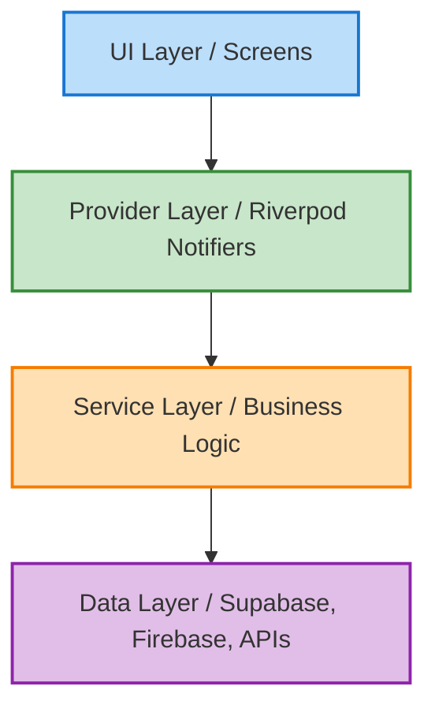
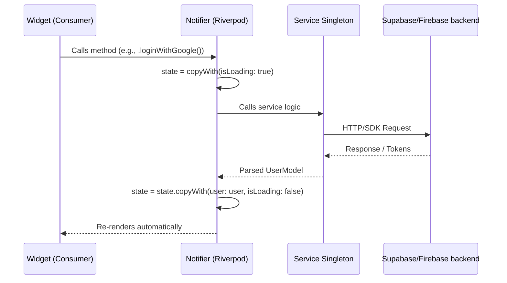

# Farmaa Mobile — Project Walkthrough

## 1. Project Overview
**Farmaa** is a comprehensive B2B digital marketplace bridging the gap between farmers and buyers across India. 

* **To whom is it for?** Farmers seeking fair prices and a broader market, and bulk buyers looking for quality grains direct from the source.
* **Why was it built?** To eliminate middlemen, ensure price transparency through a live market feed, provide AI-driven agricultural insights, and facilitate secure transactions via local payment gateways (Razorpay). 

## 2. Architecture
The app follows a **Feature-First Architecture** inside the modern Flutter directory structure.

### Why Feature-First?
Instead of grouping files by type (e.g., all screens together, all controllers together), the project groups files by the *feature* they belong to. This drastically improves scalability, making it easier for large teams to work on discrete parts of the app (like `cart_checkout` or `auth`) without stepping on each other's toes.

### Architectural Diagram


### Folder Structure
* `core/`: Application-wide resources (routing, global UI themes, API clients, app-level providers, global services).
* `features/`: The meat of the application. Contains sub-folders:
  * `admin/`: Dashboard for platform moderation.
  * `ai_chat/`: The localized chatbot logic.
  * `auth/`: Login, onboarding, profile completion.
  * `cart_checkout/`: Shopping cart, payment gateway integration.
  * `market/`: Market feeds, crop listing, price trends.
  * `my_crops/`: Stock management for standard users/farmers.
  * `shared/`: Common widgets (app shells, base wrappers) that cross feature boundaries.

## 3. State Management
The project utilizes **Riverpod (v3.x)** for state management.

### Why Riverpod?
Riverpod was chosen over Provider, Bloc, and GetX because it is compile-safe (no `ProviderNotFoundException`), scales effortlessly with heavily asynchronous data (native support for Futures/Streams via `AsyncNotifier`), and enforces a clear, immutable, uni-directional flow of data.

* **`Notifier` API:** Used heavily in Riverpod 3.0 (e.g., `NotificationNotifier`) to tie state directly to its manipulation logic cleanly.
* **`NotifierProvider`:** Houses complex states like the `AuthState` (loading, error, user object states).
* **Provider Dependencies:** Easily watched and refreshed, resolving dependencies declaratively.

### Data Flow Diagram


## 4. File-by-File Usage (Key Files)

### `main.dart`
* **What it does:** The application entry point. 
* **Why it exists:** Initializes the lowest-level bindings (`WidgetsFlutterBinding`, `SystemChrome`), sets up `.env` overrides, and critically runs asynchronous bootstraps (`Supabase.initialize`, `Firebase.initializeApp`, `GoogleAuthService.instance.initialize()`).
* **Key functions:** `main()`, `FarmaaApp` (roots the `MaterialApp.router`).

### `lib/core/services/google_auth_service.dart`
* **What it does:** Manages the integration between Google Sign-In SDK and Firebase Authentication.
* **Why it exists:** Isolates all third-party identity logic. Handles correct token exchange (`serverAuthCode` and `accessToken`) depending on the OS platform requirements.
* **Key functions:** `signIn()` (handles the UI popup and backend credential conversion), `initialize()`, `signOut()`.

### `lib/core/providers/auth_provider.dart`
* **What it does:** Defines `AuthNotifier` and `AuthState` tracking the logged-in user, loading UI states, and global errors.
* **Why it exists:** So the entire application can watch authentication state reactively without needing context, preventing unauthorized access automatically via GoRouter state changes. 
* **Key functions:** `loginWithGoogle()`, `completeProfile()`, `logout()`.

### `lib/core/services/notification_service.dart`
* **What it does:** Bridges Firebase Cloud Messaging (remote notifications) and Flutter Local Notifications Plugin (local hardware notifications).
* **Why it exists:** Creates specific Android notification channels (like High-Priority order alerts vs standard Market price alerts).
* **Key functions:** `showLocal()` (hardware trigger), `_firebaseBackgroundHandler()` (processing backend triggers while app is killed).

## 5. Algorithms & Logic Used

### **Auth Flow State Machine**
* **What it is:** A reactive state machine tied between `GoRouter` and Riverpod's `authProvider`.
* **Flow:** `LoggedOut` ➔ `Google Authenticating` ➔ `Needs Profile Details` ➔ `Fully Authenticated`.
* **Why chosen:** Ensures absolute security boundary. A user cannot bypass profile completion via deep-linking because the router natively listens to the `AuthState` dependency.

### **Local & Remote Notification Parsing**
* **Logic Explained:** Combines `StreamController` broadcasts with local hardware APIs. When FCM triggers a data payload silently, the background service captures it and calls `showLocal()` directly to dynamically construct rich notifications based on the payload (e.g., high-priority green notifications for successful crop orders).

### **Singleton Services Injection**
* **What it is:** Instead of passing classes deeply, classes like `NotificationService._()` have a `static final instance`.
* **Why chosen:** Memory efficiency O(1) space constraint, guaranteeing only one WebSocket or MethodChannel is aggressively consuming native memory per service.

## 6. Third-Party Packages & Why

| Package | Purpose | Why chosen |
|--------|---------|------------|
| `supabase_flutter` | Backend Database | Offers instant Realtime PostgreSQL subscriptions for market data. |
| `firebase_auth` & `google_sign_in` | Authentication | Battle-tested, secure, standard infrastructure for consumer applications. |
| `flutter_riverpod` | State Management | Secure compile-safe provider tree allowing massive application scale. |
| `go_router` | Navigation | True declarative routing supporting web-style URIs matching and redirect guards. |
| `dio` | Networking | Superior over `http` for automatic JSON parsing, interception, and timeout policies. |
| `razorpay_flutter` | Payments | Industry standard for secure UPI, Card, and Net-banking payments in India. |
| `flutter_local_notifications` | UX / Updates | Necessary to render hardware-specific heads-up notifications locally. |
| `google_fonts` | Typography | Eliminates the need to bundle static fonts, dynamically loading licensed typography. |

## 7. API & Data Flow

### Order Placement Data Flow
1. **Cart Checkout:** User submits an order in `checkout_screen.dart`.
2. **Payment Gateway:** Razorpay SDK handles the payment. Payment ID returned.
3. **Provider:** `CartProvider` sends the finalized payment data to `OrderService`.
4. **Service ➔ Supabase:** `OrderService` inserts rows into the backend.
5. **Backend ➔ App (Realtime):** Supabase triggers a PostgreSQL webhook logic or Realtime broadcast.
6. **Notification:** FCM blasts an update to the farmer ("New Order Received!"), rendered locally via `NotificationService`.

## 8. Commands Reference

```bash
# Get dependencies
flutter pub get

# Setup / Generate Code (Freezed, JSON, Riverpod)
flutter pub run build_runner build --delete-conflicting-outputs

# Build and run locally
flutter run

# Build a production Android release
flutter build apk --release

# Note: Once built, you can upload to GitHub using the GitHub CLI:
gh release create v1.0.0 \
  build/app/outputs/flutter-apk/app-release.apk \
  --title "Release v1.0.0" \
  --notes "Production build"
```

## 9. Known Issues & Future Ideas
* **Known Limitations:**
  * Complex real-time synchronization may experience slight latency jumps under aggressive connection throttling/drops.
  * Local notification scheduling relies rigidly on background isolate startup (depends heavily on strict vendor Android OS process management).
* **Future Ideas:**
  * **Offline Sync:** Add SQLite or Hive for comprehensive offline capabilities, allowing farmers to draft crops without a connection.
  * **Video Integration:** Allow farmers to upload short video segments showing crop quality instead of solely still images.
  * **Machine Learning:** Incorporate edge-run `.tflite` models for on-device leaf disease detection.
